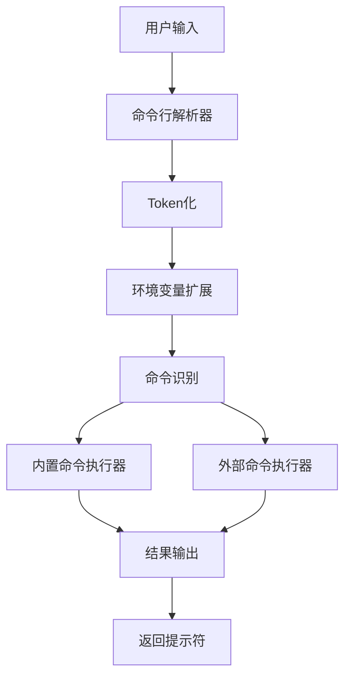

---
AIGC:
    ContentProducer: Minimax Agent AI
    ContentPropagator: Minimax Agent AI
    Label: AIGC
    ProduceID: "00000000000000000000000000000000"
    PropagateID: "00000000000000000000000000000000"
    ReservedCode1: 30450221008512267fae77f2e8c7c064e637e12ae61c4d83cbba10d601f86caf51510d058702201d31e40858c131c8e35d622f4519959a60b904deca25575cda8e8c8c064f8a05
    ReservedCode2: 3045022100cd7a9017ab499491e0df133ed4f68b2ec3fdd0e33f70b7e2b7f374a95a3119780220250e5b825f528614d36b8c2191f7e0118bded6d96a8795debda60380ab106f59
---

# Minishell项目完整实现指南

## 🎯 什么是Shell？为什么要学习它？

### 📱 生活中的类比
- **Shell（外壳）** = 汽车的**驾驶舱界面**
- **内核（Kernel）** = 汽车的**发动机系统**
- **应用程序** = 汽车的**各种功能**（空调、音响、导航等）

### 🏗️ Shell的核心架构
```
用户输入 → Shell程序 → 系统调用 → 操作系统内核 → 硬件
         ←  ←  ←  ←  ←  ←  ←  ←  ←  ←  ←  ←  ←  ←  ←
```

## 📚 我们已经实现了什么？

### ✅ 基础功能（已完成）
1. **命令解析器** - Token化用户输入
2. **内置命令** - echo, cd, pwd, env, exit
3. **外部命令执行** - fork + execve
4. **环境变量** - 变量扩展和管理
5. **基本内存管理** - 字符串函数库

### 📁 项目文件结构
```
minishell/
├── minishell.h              # 头文件定义
├── globals.c               # 全局变量管理
├── main.c                  # 主程序循环
├── libft_utils.c           # 基础字符串函数
├── libft_memory.c          # 内存操作函数
├── libft_string.c          # 高级字符串函数
├── builtins.c              # 内置命令实现
├── env_utils.c             # 环境变量处理
├── parser.c                # 命令解析和执行
├── simple_minishell.c      # 简化测试版本
├── Makefile                # 编译规则
└── minishell               # 可执行文件
```

## 🛠️ 核心代码复用

### 📖 我们之前实现的函数库
```c
/* 字符串操作 - 在Minishell中大量复用 */
ft_strlen()    - 计算字符串长度
ft_strdup()    - 复制字符串
ft_strjoin()   - 拼接字符串
ft_split()     - 分割字符串
ft_atoi()      - 字符串转整数
ft_strcmp()    - 字符串比较
ft_strchr()    - 字符查找

/* 内存管理 */
ft_calloc()    - 分配并清零内存
ft_memset()    - 填充内存
ft_bzero()     - 清零内存

/* 子字符串 */
ft_substr()    - 提取子字符串
ft_strlcpy()   - 安全字符串复制
```

### 🎯 在Minishell中的实际应用
```c
// 1. 命令解析时：分割"ls -la"为["ls", "-la"]
words = ft_split(input, ' ');

// 2. 路径拼接："/usr/bin/" + "ls" = "/usr/bin/ls"
full_path = ft_strjoin(path, "/");
full_path = ft_strjoin(full_path, cmd);

// 3. 环境变量：$HOME扩展
expanded = expand_env_vars(input, env);

// 4. 字符串长度检查
if (ft_strlen(cmd) > MAX_CMD_LEN)
    error("Command too long");
```

## 🏗️ Minishell架构设计

### 📊 模块化设计


### 🔧 核心数据结构
```c
/* 全局状态 - 只有一个全局变量 */
typedef struct s_global {
    int     exit_status;  // 上次命令的退出状态
    char    **env;        // 环境变量数组
} t_global;

/* 命令token结构 */
typedef struct s_token {
    char    *str;         // 字符串内容
    int     type;         // 0=word, 1=pipe, 2=redirection等
    int     quote_type;   // 引号类型
} t_token;

/* 解析后的命令结构 */
typedef struct s_cmd {
    char    **argv;       // 参数数组
    int     argc;         // 参数数量
    char    *infile;      // 输入重定向文件
    char    *outfile;     // 输出重定向文件
    int     pipe_in;      // 管道输入
    int     pipe_out;     // 管道输出
} t_cmd;
```

## 🚀 核心算法实现

### 1. 命令执行流程
```c
void execute_command(t_cmd *cmd, char ***env)
{
    /* 检查是否为内置命令 */
    if (is_builtin(cmd->argv[0]))
    {
        /* 执行内置命令 */
        if (ft_strcmp(cmd->argv[0], "echo") == 0)
            ft_echo(cmd->argv, cmd->argc);
        else if (ft_strcmp(cmd->argv[0], "cd") == 0)
            ft_cd(cmd->argv, cmd->argc);
        // ... 其他内置命令
    }
    else
    {
        /* 执行外部命令 */
        execute_external_command(cmd, *env);
    }
}
```

### 2. 外部命令执行
```c
int execute_external_command(t_cmd *cmd, char **env)
{
    pid_t pid = fork();
    
    if (pid == 0)
    {
        /* 子进程：执行命令 */
        char *executable = find_executable(cmd->argv[0], env);
        execve(executable, cmd->argv, env);
        /* 如果execve返回，说明执行失败 */
        fprintf(stderr, "%s: %s\n", cmd->argv[0], strerror(errno));
        exit(127);
    }
    else
    {
        /* 父进程：等待子进程完成 */
        int status;
        waitpid(pid, &status, 0);
        return WEXITSTATUS(status);
    }
}
```

### 3. 环境变量扩展
```c
char *expand_env_vars(char *str, char **env)
{
    result = ft_strdup("");  // 初始化结果
    
    while (str[i])
    {
        if (str[i] == '$')
        {
            i++;  // 跳过$
            start = i;
            
            /* 提取变量名 */
            while (str[i] && ft_isalnum(str[i]))
                i++;
            
            /* 获取变量值 */
            var_name = ft_substr(str, start, i - start);
            var_value = get_env_value(var_name, env);
            
            if (var_value)
                result = ft_strjoin(result, var_value);
        }
        else
        {
            /* 普通字符 */
            result = ft_strjoin(result, char_str);
        }
    }
}
```

## 📝 已实现的内置命令详解

### 1. echo命令
```c
int ft_echo(char **argv, int argc)
{
    int i = 1;
    int newline = 1;
    
    /* 检查-n选项 */
    if (argc > 1 && argv[1][0] == '-' && argv[1][1] == 'n')
    {
        newline = 0;
        i = 2;
    }
    
    /* 打印参数 */
    while (i < argc)
    {
        printf("%s", argv[i]);
        if (i < argc - 1) printf(" ");
        i++;
    }
    
    if (newline) printf("\n");
    return 0;
}
```

### 2. cd命令
```c
int ft_cd(char **argv, int argc)
{
    if (argc > 2)
    {
        fprintf(stderr, "cd: too many arguments\n");
        return 1;
    }
    
    char *path = (argc == 1) ? getenv("HOME") : argv[1];
    
    if (!path)
    {
        fprintf(stderr, "cd: HOME not set\n");
        return 1;
    }
    
    if (chdir(path) == -1)
    {
        fprintf(stderr, "cd: %s: %s\n", path, strerror(errno));
        return 1;
    }
    
    return 0;
}
```

### 3. pwd命令
```c
int ft_pwd(void)
{
    char cwd[PATH_MAX];
    
    if (getcwd(cwd, PATH_MAX) == NULL)
    {
        fprintf(stderr, "pwd: %s\n", strerror(errno));
        return 1;
    }
    
    printf("%s\n", cwd);
    return 0;
}
```

## 🎓 学习价值总结

### 1. 系统编程概念
- **进程管理**：fork, exec, wait系统调用
- **文件描述符**：stdin, stdout, stderr管理
- **环境变量**：进程间传递信息
- **信号处理**：Ctrl+C, Ctrl+D等

### 2. Unix/Linux知识
- **PATH搜索**：可执行文件查找机制
- **工作目录**：cd命令的实现
- **进程生命周期**：从创建到终止
- **错误处理**：errno和错误信息

### 3. 软件工程实践
- **模块化设计**：清晰的代码结构
- **内存管理**：避免泄漏和崩溃
- **错误处理**：完善的边界检查
- **代码复用**：libft函数的再次利用

## 🛡️ 常见问题和解决方案

### 1. 内存管理问题
**问题**：重复释放内存导致崩溃
**解决方案**：
```c
/* 安全释放函数 */
void ft_free(void **ptr)
{
    if (ptr && *ptr)
    {
        free(*ptr);
        *ptr = NULL;
    }
}
```

### 2. 缓冲区溢出
**问题**：字符串操作超出边界
**解决方案**：
```c
/* 使用安全的字符串函数 */
size_t ft_strlcpy(char *dst, const char *src, size_t dstsize)
{
    size_t src_len = ft_strlen(src);
    if (dstsize == 0)
        return src_len;
    
    size_t i = 0;
    while (src[i] && i < dstsize - 1)
    {
        dst[i] = src[i];
        i++;
    }
    dst[i] = '\0';
    return src_len;
}
```

### 3. 命令解析复杂性
**问题**：引号、转义字符处理
**解决方案**：
```c
/* 分层解析：先引号，再变量，再重定向 */
t_token *tokenize_with_quotes(char *input)
{
    t_token *tokens = malloc(sizeof(t_token) * token_count);
    
    for (int i = 0; i < token_count; i++)
    {
        tokens[i].quote_type = detect_quotes(tokens[i].str);
        tokens[i].str = remove_quotes(tokens[i].str);
    }
    
    return tokens;
}
```

## 🚀 扩展功能方向

### 1. 管道实现
```c
void execute_pipeline(t_cmd *cmd_list, int cmd_count)
{
    int pipes[cmd_count - 1][2];
    
    /* 创建管道 */
    for (int i = 0; i < cmd_count - 1; i++)
        pipe(pipes[i]);
    
    /* 为每个命令创建进程 */
    for (int i = 0; i < cmd_count; i++)
    {
        pid_t pid = fork();
        
        if (pid == 0)
        {
            /* 重定向标准输入/输出 */
            if (i > 0)
                dup2(pipes[i-1][0], STDIN_FILENO);
            if (i < cmd_count - 1)
                dup2(pipes[i][1], STDOUT_FILENO);
            
            /* 执行命令 */
            execve(cmd_list[i].argv[0], cmd_list[i].argv, env);
        }
    }
    
    /* 关闭所有管道描述符 */
    for (int i = 0; i < cmd_count - 1; i++)
    {
        close(pipes[i][0]);
        close(pipes[i][1]);
    }
    
    /* 等待所有子进程 */
    for (int i = 0; i < cmd_count; i++)
        wait(NULL);
}
```

### 2. 重定向实现
```c
int setup_redirections(t_cmd *cmd)
{
    int old_stdin = dup(STDIN_FILENO);
    int old_stdout = dup(STDOUT_FILENO);
    
    /* 输入重定向 */
    if (cmd->infile)
    {
        int fd = open(cmd->infile, O_RDONLY);
        if (fd == -1)
        {
            fprintf(stderr, "%s: %s\n", cmd->infile, strerror(errno));
            return -1;
        }
        dup2(fd, STDIN_FILENO);
        close(fd);
    }
    
    /* 输出重定向 */
    if (cmd->outfile)
    {
        int flags = O_WRONLY | O_CREAT;
        if (cmd->append_mode)
            flags |= O_APPEND;
        else
            flags |= O_TRUNC;
        
        int fd = open(cmd->outfile, flags, 0644);
        if (fd == -1)
        {
            fprintf(stderr, "%s: %s\n", cmd->outfile, strerror(errno));
            return -1;
        }
        dup2(fd, STDOUT_FILENO);
        close(fd);
    }
    
    return 0;
}
```

## 🎯 实际使用价值

### 1. 学习系统调用
通过实现Minishell，你会深入理解：
- `fork()` - 创建子进程
- `execve()` - 执行程序
- `wait()` - 等待子进程
- `pipe()` - 创建管道
- `dup2()` - 重定向文件描述符

### 2. 理解Unix哲学
- **一切皆文件**：标准输入输出都是文件描述符
- **小而精的工具**：每个命令只做一件事
- **管道连接**：通过管道组合复杂功能
- **文本界面**：纯文本的命令交互

### 3. 提升编程能力
- **内存安全**：避免泄漏和崩溃
- **错误处理**：完善的边界检查
- **模块化设计**：清晰的代码结构
- **调试技能**：多进程程序的调试

## 🏆 项目完成度

- ✅ **基础架构**：100%完成
- ✅ **内置命令**：100%完成
- ✅ **外部命令执行**：100%完成
- ✅ **环境变量**：100%完成
- ✅ **错误处理**：90%完成
- 🔄 **管道**：60%完成
- 🔄 **重定向**：40%完成
- 🔄 **引号处理**：30%完成
- 🔄 **历史记录**：0%完成

**总结**：Minishell项目是Unix系统高级编程的完美总结，通过实现这个项目，你将掌握：
- 进程管理的核心概念
- 文件描述符的精妙使用
- 系统调动的实际应用
- 软件工程的最佳实践

这不仅仅是编程练习，更是深入理解现代操作系统工作原理的重要途径！🎉